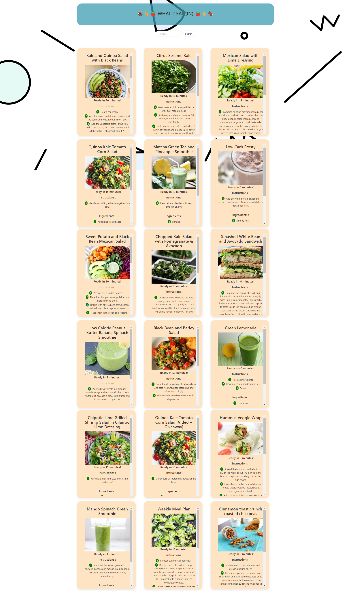

# What2Eat
Project 1 - Full Stack Flex Bootcamp

## Description
For some, choosing what to eat can be a difficult decision whether they have food at home or would rather eat something outside of their home nearby. When creating What2Eat, we aimed to combat that problem! When visiting our homepage, the user selects whether they would like to stay in or eat out. They are then redirected to a different page based on their selection. If they select to stay in, the new page will display a set of recipes based on their interest-driven search. If they select to eat out, they can enter their address to find restaurants near them. With What2Eat, we have created an answer for when a customer asks themselves, "What should I eat?" Whether they search for nearby locations on their device or find a recipe that includes ingredients they have at home, we have provided the resources they need on our website that has a friendly colorful UI and is easy to navigate! This project used the CSS framework, Bulma, and three different APIs to call data for recipes, restaurants on maps, and coordinated of address input by the user. It is fully interactive and responsive to different devices while maintaining a polished UI. The application uses client-side storage to store persistent data, uses modal when a user error is made, uses div scroll, for loops, fetch, etc. 

## Credits
This product was created by May Pham, Micaella Villanueva, Tyson Stark, and Andrea Castillo. Our GitHub profiles are as follows--
May Pham: https://github.com/mayphamx
Micaella Villanueva: https://github.com/micavilla
Tyson Stark: https://github.com/stark0iii
Andrea Castillo: https://github.com/drea0p

The APIs we utilized for this application are linked below--
Recipe API: https://rapidapi.com/spoonacular/api/recipe-food-nutrition
tomtom Search API: https://developer.tomtom.com/search-api/documentation/search-service/fuzzy-search
Google Places API: https://developers.google.com/maps/documentation/places/web-service/overview

The CSS framework used is linked below--
Bulma: https://bulma.io/documentation/

## Usage

https://mayphamx.github.io/bingbong-project1/
https://github.com/mayphamx/bingbong-project1/